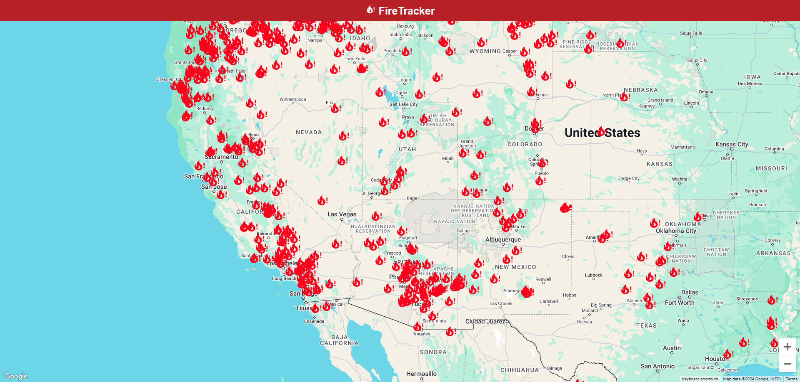

# wildfire-tracker

<!-- ABOUT THE PROJECT -->
## About the Project

A frontend application that displays real-time wildfire data on rendered map.




### Built With

* [![JavaScript][javascript.com]][JavaScript-url]


<!-- GETTING STARTED -->
## Getting Started

```
npm install
npm start
```


<!-- MARKDOWN LINKS & IMAGES -->
<!-- https://www.markdownguide.org/basic-syntax/#reference-style-links -->
[javascript.com]: https://img.shields.io/badge/logo-javascript-blue?logo=javascript
[JavaScript-url]: https://www.javascript.com/